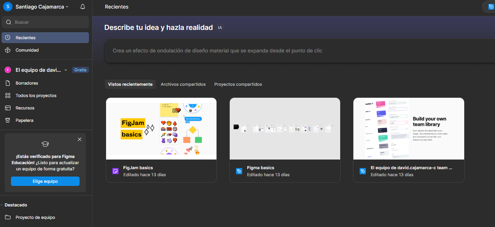
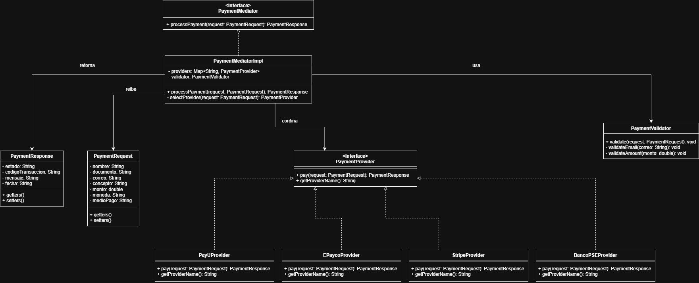

## David Santiago Cajamarca Cadena / Grupo 02

## PUNTO 1:

## PUNTO 2:

- **FACTORY METHOD/creacional:** Elijo este patron debido que el enunciado dice textualmente 
"Cada proveedor expone la información de forma distinta y maneja sus propios
  campos obligatorios. El sistema interno de la Escuela NO puede depender de
  ninguna implementación específica." Este patron me aprece ideal debido que 
proporciona una interfaz para crear objetos en una super clase, mientras permite
a las subclases el tipo de objetos que crearian en este caso sus propios formularios
y campos obligatorios.

- **MEDIATOR/coportamiento:** Eleji este patron debido que en el enunciaco de menciona 
"El sistema debe permitir cambiar de proveedor sin modificar el código del
  proceso principal de pago. Cada tipo de medio de pago puede usar un
  proveedor diferente. El sistema debe unificar la respuesta en un solo formato
  institucional" Y el metodo mediator permite justamente reducir las dependencias 
caoticas entre objetos pues el patron restinge las comunicaciones directas entre objetos
forzandolos a colaborar unicamente atravez de un objeto mediador. Esto nos va a permitir 
mantener un solo formato de salida y el poder cambiar de objetos sin caos.

## PUNTO 3:

- **Funcionales:**
  - Guardar la informacion de pago en AWS Mongo Atlas
  - Guardar los certificados academicos asosiados en AWS S3 Bucket
  - Permitir que se pueda usar cualquier proveedor externo de los disponibles (Este usaria el patron Mediator)
- **No Funcionales:**
  - La interfaz de la app web debe tener la paleta de colores correspondiente a la escuela.
  - La app debe ser responsive.

## PUNTO 4:

## ## PUNTO 5: Análisis de requerimientos

## Código
RF-01

## Nombre
Guardar informacion de pago en AWS Mongo Atlas

## Descripción
La app web debe enviar la informacion de pago (cuenta de donde viene la transaccion, fecha, nombre titular, etc...)
a AWS Mongo Atlas y permitir que u usuario logueado consulte esta informacion desde la pagina.
## Cómo se ejecutará
1. El usuario ingresa a la página.
2. La pagina tiene un apartado de facturas al que el usuario accede.
3. El usuario completa los campos de confirmacion de identidad requeridos.
4. El usuario envía la solicitud.
5. El sistema valida datos, registra la inscripción y confirma el resultado.

## Actor principal
Usuario institucional, es decir una persona interesada en inscribirse a la carrera (debe tener correo intitucional).

## Precondiciones
- El usuario tiene acceso a internet y a la página de la escuela.
- El usuario tyiene correo instutucional.
- El usuario cuenta con la información personal y académica requerida.

## Datos de entrada
- Datos personales: nombres, apellidos, tipo y número de documento, fecha de nacimiento.
- Servicio institucional elegido: Inscripción a Bootcamp, pago de certificados academicos, etc...

## Datos de salida
- Número de solicitud.
- Estado.
- Mensajes de validación.
- Codigo.

## Flujo básico
1. El usuario ingresa a la sección de facturas.
2. El sistema presenta el formulario con los campos requeridos.
3. El usuario diligencia los datos solicitados.
4. El usuario confirma que la información es correcta y acepta términos.
5. El usuario envía la solicitud.
6. El sistema valida obligatoriedad y formato de los campos.
7. El sistema registra la solicitud de factura.
8. El sistema muestra la factura.

## Flujo alterno
A1. Campos obligatorios incompletos
- En el paso 6, el sistema detecta campos obligatorios vacíos.
- El sistema muestra mensajes indicando qué campos faltan.
- El usuario corrige y reintenta el envío.

A2. Formato inválido
- En el paso 6, el sistema detecta algun formato incorrecto.
- El sistema informa el error por campo y no registra la solicitud.
- El usuario corrige y reenvía.

## Código
RF-02

## Nombre
Permitir que se pueda usar cualquier proveedor externo de los disponibles

## Descripción
El sistema debe permitir procesar pagos atraves de cualquiera de los proveedores externos disponibles.
El sistema interno de la Escuela no debe depender de ninguna implementación específica de proveedor, 
permitiendo cambiar o agregar proveedores sin modificar el código del proceso principal de pago. 
La respuesta decualquier proveedor debe unificarse en un formato institucional estándar compuesto 
por estado, codigoTransaccion, mensaje, fechs.

## Cómo se ejecutará
1. El usuario ingresa a la plataforma.
2. El usuario diligencia el formulario de solicitud de pago con sus datos personales y del pago.
3. El usuario selecciona el medio de pago.
4. El sistema determina automáticamente el proveedor adecuado según las regla.
5. El sistema adapta la solicitud al formato específico del proveedor seleccionado y la envía.
6. El sistema recibe la respuesta del proveedor, la traduce al formato institucional unificado y 
la retorna al usuario.

## Actor principal
Usuario institucional, es decir cualquier persona con correo institucional o que desea realizar un 
pago asosiado a la escuela.

## Precondiciones
- El usuario tiene acceso a internet y a la psgina.
- El usuario cuenta con un correo institucional.
- El monto del pago es mayor a 5.000 cop.

## Datos de entrada
- Nombre del pagador.
- Documento de identidad.
- Correo institucional.
- Objetivo del pago.
- Monto.
- Moneda.
- Medio de pago.

## Datos de salida
- Estado: APROBADO, RECHAZADO o PENDIENTE.
- Código.
- Mensaje.
- Fecha.

## Flujo básico
1. El usuario ingresa a la sección de pagos de la pagina.
2. El sistema presenta el formulario de solicitud de pago con los campos requeridos.
3. El usuario diligencia los datos personales.
4. El usuario selecciona el motivo del pago y diligencia el monto y la moneda.
5. El usuario selecciona el medio de pago.
6. El sistema valida la todos los campos.
7. El sistema valida las reglas de negocio.
8. El sistema selecciona automáticamente el proveedor adecuado según las reglas.
9. El sistema adapta los datos de la solicitud al formato específico del proveedor seleccionado.
10. El sistema envía la solicitud al proveedor externo.
11. El proveedor procesa el pago y retorna una respuesta en su formato.
12. El sistema traduce la respuesta del proveedor al formato institucional.
13. El sistema almacena la información del pago en AWS Mongo Atlas.
14. El sistema presenta al usuario la respuesta.

## Flujo alterno
A1. Correo no institucional
- En el paso 7, el sistema detecta que el correo no es instituional.
- El sistema muestra el estado RECHAZADO con el mensaje "Correo no institucional permitido".
- El usuario corrige el correo y reintenta el envío.

## PUNTO 6:

### epica

**Integracion centralizada de proveedores de pago**

Necesitamos centralizar el procesamiento de pagos a través de multiples provedores externos 
usando un mediador que cordine toda la comunicacion, para que el proceso principal de pago no 
dependa de ningun provedor especifico.

### Historia de Usuario

**Procesar un pago usando cualquier proveedor disponible**

**COMO** usuario, **QUIERO** realizar un pago seleccionando mi medio de pago preferido, **PARA QUE** 
el sistema se encargue de elegir el proveedor correcto y me devuelva una respuesta en un 
formato unico y yo pueda agilizar mis pagos.

**Criterios de aceptación:**
- Si pago en USD, el sistema usa Stripe automaticamente.
- Si el medio de pago es PSE, el sistema usa Banco PSE.
- La respuesta siempre tiene el mismo formato: estado, codigoTransaccion, mensaje y fecha.
- Si el proveedor falla, el sistema responde con PENDIENTE.
- Los campos extra que devuelva el proveedor se ignoran.

### Tareas

**T-01:**

Crear la interfaz paymentMediator que haga como punto central de comunicacion entre el servicio de 
pagos y los proveedores. La implementacion concreta (paymentMediatorImpl) se encarga de recibir la
solicitud de pago, aplicar las reglas de negocio para elegir el proveedor correcto, 
y devolver la respuesta en formato unico.

**T-02**

Crear las clases que se comunican con cada proveedor: PayUProvider, EPaycoProvider, StripeProvider
y BancoPSEProvider. Cada una traduce la solicitud de pago al formato que el proveedor necesita 
y convierte la respuesta al formato unico. Tambien denen manejar el caso de que el proveedor falle 
y devolver PENDIENTE.

**T-03**

Meter las validaciones de negocio antes de enviar el pago, que el correo sea institucional, que 
el monto sea mayor a 5.000 cop, que si la moneda es USD solo se use Stripe, y que si el medio es 
PSE solo se use Banco PSE. Estas reglas las debe aplicar el mediador antes de delegar al proveedor 
correspondiente.

## PUNTO 7:

